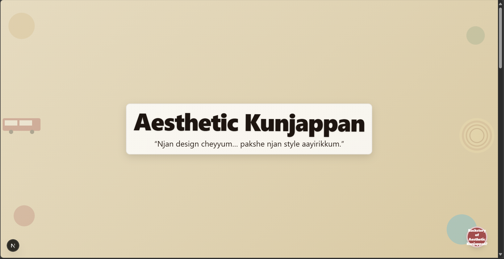
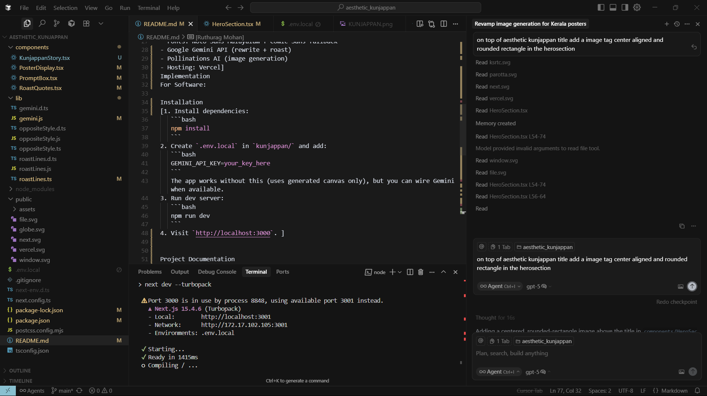
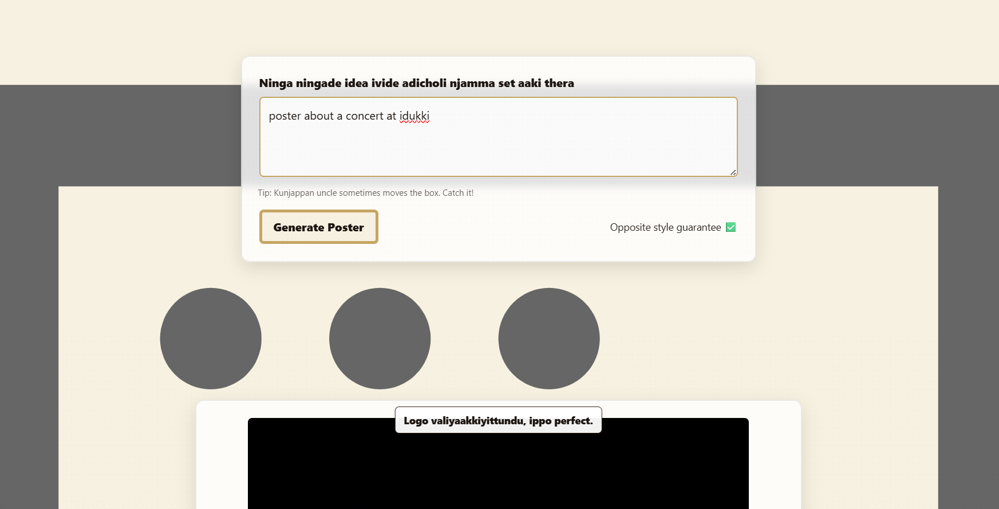

[Aesthetic Kunjappan] 🎯
Basic Details
Team Name: [TPRXIJK]
Team Members
Team Lead: [Tharun Krishna CU] - [Christ College of Engineering]
Member 2: [Ruthurag Mohan] - [Christ College of Engineering]

Project Description
[Sarcastic Kerala-rooted poster generator built with Next.js App Router. It behaves like an old Kerala uncle who ignores your request and creates the complete opposite style — but with modern, cinematic taste and subtle cultural nods.]

The Problem (that doesn't exist)
[We’re solving the problem of posters being too accurate and too pretty.
Aesthetic Kunjappan ensures your request is flipped, roasted, and designed like a 90s uncle’s chaotic masterpiece.

The Solution (that nobody asked for)
[The Solution (that nobody asked for)
By taking your idea, flipping it on its head with AI, sprinkling in sarcastic uncle-level roasts, and generating a gloriously wrong poster.
It’s design… but with maximum disrespect and minimum relevance.k]

Technical Details
Technologies/Components Used
For Software:

[- Next.js (App Router)
- TailwindCSS v4
- Framer Motion
- Fonts: Noto Sans Malayalam + Comic Sans fallback
- Google Gemini API (rewrite + roast)
- Pollinations AI (image generation)
- Hosting: Vercel]
Implementation
For Software:

Installation
[1. Install dependencies:
   ```bash
   npm install
   ```
2. Create `.env.local` in `kunjappan/` and add:
   ```bash
   GEMINI_API_KEY=your_key_here
   ```
   The app works without this (uses generated canvas only), but you can wire Gemini when available.
3. Run dev server:
   ```bash
   npm run dev
   ```
4. Visit `http://localhost:3000`. ]


Project Documentation
For Software:

Screenshots (Add at least 3)
 

 




Project Demo
Video
[https://drive.google.com/file/d/1h1ePhlq288Y-dXeVmaD7IuH8RyaNuszl/view?usp=sharing]


Team Contributions
[Tharun Krishna CU]: [Developer]
[Ruthurag Mohan]: [UI Designer]
